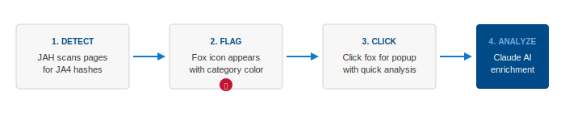
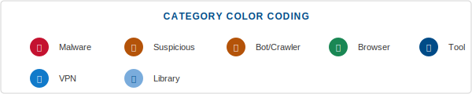
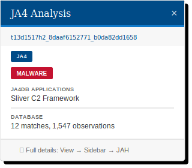
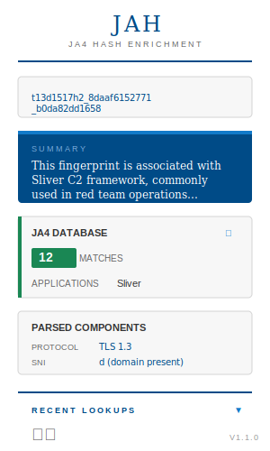

# JAH — JA4 Hash Enrichment

<p align="center">
  
</p>

<p align="center">
  <strong>A Firefox extension for analyzing JA4+ fingerprint hashes</strong><br>
  <em>Powered by Claude AI and the JA4 Database</em>
</p>

<p align="center">
  
  
  
</p>

---

## What is JAH?

JAH (JA4 Hash Enrichment) is a Firefox extension that helps security analysts, threat hunters, and researchers quickly identify and analyze JA4+ fingerprints found on web pages. When JAH detects a JA4 fingerprint, it:

1. **Flags it** with a fox icon showing the threat category
2. **Looks it up** in the JA4 Database (ja4db.com)
3. **Analyzes it** using Claude AI for detailed threat intelligence

<p align="center">
  
</p>

---

## What are JA4+ Fingerprints?

[JA4+](https://github.com/FoxIO-LLC/ja4) is a suite of network fingerprinting methods created by FoxIO that identify TLS clients, servers, HTTP clients, and more. These fingerprints are invaluable for:

- **Threat Detection** — Identifying malware C2 frameworks like Sliver, Cobalt Strike, and Metasploit
- **Attribution** — Tracking threat actors across infrastructure
- **Behavioral Analysis** — Understanding client/server relationships
- **Anomaly Detection** — Spotting unusual TLS implementations

### Supported Fingerprint Types

| Type | Description | Example |
|------|-------------|---------|
| **JA4** | TLS Client Fingerprint | `t13d1516h2_8daaf6152771_b0da82dd1658` |
| **JA4S** | TLS Server Fingerprint | `t130200_1301_234ea6891581` |
| **JA4H** | HTTP Client Fingerprint | `ge11cn20enus_60ca1bd65281_ac95b44401d9_8df6a44f726c` |
| **JA4SSH** | SSH Fingerprint | `c76s56p21_i76o21` |

---

## Features

### Automatic Page Scanning

JAH automatically scans web pages for JA4 fingerprints and marks them with a fox icon. The icon's glow color indicates the category:

<p align="center">
  
</p>

### Category Color Coding

| Category | Color | Description |
|----------|-------|-------------|
| **Malware** | 🔴 Red | Known malware, C2 frameworks (Sliver, Cobalt Strike, etc.) |
| **Suspicious** | 🟠 Orange | Potentially concerning fingerprints |
| **Bot** | 🟠 Orange | Web crawlers and automated tools |
| **Browser** | 🟢 Green | Legitimate web browsers (Chrome, Firefox, Safari) |
| **Tool** | 🔵 Navy | CLI tools (curl, wget) |
| **VPN** | 🔵 Blue | VPN clients |
| **Library** | 🔵 Light Blue | Programming libraries (Python requests, Go net/http) |

### Quick Analysis Popup

Click any fox icon to see a quick analysis popup:

<p align="center">
  
</p>

The popup shows:
- Fingerprint type and hash
- Threat category badge
- JA4DB matches and applications
- Observation count

### Full Sidebar Analysis

For detailed analysis, open the JAH sidebar (View → Sidebar → JAH):

<p align="center">
  
</p>

The sidebar provides:
- **AI-Generated Summary** — Claude analyzes the fingerprint and provides context
- **JA4 Database Results** — Applications, libraries, user agents, and observation counts
- **Parsed Components** — Breakdown of protocol version, SNI, cipher suites, etc.
- **Detailed Analysis** — In-depth threat intelligence and recommendations
- **Lookup History** — Quick access to previous analyses

### Right-Click Enrichment

Select any JA4 fingerprint text, right-click, and choose "Enrich JA4 Hash" to analyze it immediately.

---

## Installation

### Signed Extension (Recommended)

Download the latest signed `.xpi` from the [Releases](https://github.com/bluesquidjump/jah/releases) page, then:

1. Open Firefox
2. Go to `about:addons` (or menu → Add-ons and themes)
3. Click the **gear icon** ⚙️ at the top
4. Select **"Install Add-on From File..."**
5. Choose the downloaded `.xpi` file
6. Click **Add** when prompted

The extension will be permanently installed and persist across browser restarts.

### From Source (Development)

For development or testing the latest changes:

1. Clone this repository:
   ```bash
   git clone https://github.com/bluesquidjump/jah.git
   ```

2. Open Firefox and navigate to `about:debugging`

3. Click "This Firefox" in the sidebar

4. Click "Load Temporary Add-on..."

5. Navigate to the `jah` folder and select `manifest.json`

> **Note:** Temporary add-ons are removed when Firefox closes. For permanent installation, use the signed extension above or [sign your own build](https://extensionworkshop.com/documentation/develop/getting-started-with-web-ext/#signing-your-extension-for-self-distribution).

### Configuration

1. Click the gear icon in the JAH sidebar or go to the extension options

2. Enter your **Claude API Key** from [console.anthropic.com](https://console.anthropic.com/)

3. (Optional) Configure additional integrations:
   - **Brave Search API** — Web search for threat intelligence
   - **VirusTotal** — Malware sample lookups
   - **Shodan** — Infrastructure searches

---

## Usage

### Automatic Detection

Simply browse the web. When JAH detects a JA4 fingerprint:

1. A **fox icon** appears next to the fingerprint
2. The icon **glows** with a color indicating the category
3. **Hover** to see a quick tooltip
4. **Click** to open the analysis popup

### Manual Analysis

1. **Select** any JA4 fingerprint text on a page
2. **Right-click** and choose "Enrich JA4 Hash"
3. The sidebar opens with full analysis

### Viewing History

1. Open the JAH sidebar (View → Sidebar → JAH)
2. Click "Recent Lookups" at the bottom
3. Click any previous lookup to view it again

---

## Example Fingerprints

Test JAH with these known fingerprints:

| Fingerprint | Application |
|-------------|-------------|
| `t13d1517h2_8daaf6152771_b0da82dd1658` | Chrome (Windows) |
| `t13d1516h2_8daaf6152771_02713d6af862` | Firefox |
| `t12d5909h1_e8f1e7e78f70_9aade0eb1cf0` | curl |

---

## Malware Detection

JAH automatically identifies fingerprints associated with known malware and offensive tools:

- **Sliver** — Red team C2 framework
- **Cobalt Strike** — Commercial adversary simulation
- **Metasploit/Meterpreter** — Penetration testing framework
- **Brute Ratel** — Red team C2 framework
- **Havoc** — Open-source C2 framework
- **Empire** — Post-exploitation framework
- **AsyncRAT/QuasarRAT** — Remote access trojans
- And many more...

When a malware fingerprint is detected, JAH displays it with a **red glow** and **MALWARE badge**.

---

## Privacy & Security

- **API Keys** are stored locally in Firefox's extension storage
- **No telemetry** — JAH does not send data anywhere except configured APIs
- **JA4DB queries** are made directly to ja4db.com
- **Claude API calls** are made directly to api.anthropic.com

---

## Technical Details

### Permissions

| Permission | Purpose |
|------------|---------|
| `storage` | Store API keys, settings, and history |
| `contextMenus` | Right-click "Enrich JA4 Hash" option |
| `activeTab` | Read selected text for analysis |
| `https://api.anthropic.com/*` | Claude AI API calls |
| `https://ja4db.com/*` | JA4 Database lookups |

### Architecture

```
jah/
├── manifest.json          # Extension manifest
├── background/            # Service worker
│   └── background.js      # API coordination, context menu
├── content/               # Content scripts
│   ├── content.js         # Page scanning, fox icons, popups
│   └── content.css        # Styling
├── sidebar/               # Sidebar panel
│   ├── sidebar.html
│   ├── sidebar.css
│   └── sidebar.js
├── options/               # Settings page
│   ├── options.html
│   ├── options.css
│   └── options.js
├── lib/                   # Shared libraries
│   ├── ja4-parser.js      # JA4 fingerprint parsing
│   ├── ja4db-client.js    # JA4DB API client
│   ├── claude-api.js      # Claude AI client
│   └── mcp-client.js      # MCP integrations
├── data/                  # Static data
│   └── known-fingerprints.json
└── icons/                 # Extension icons
```

---

## Credits

- **JA4+ Fingerprinting** by [FoxIO](https://github.com/FoxIO-LLC/ja4)
- **JA4 Database** at [ja4db.com](https://ja4db.com)
- **Claude AI** by [Anthropic](https://anthropic.com)

---

## License

MIT License — See [LICENSE](LICENSE) for details.

---

<p align="center">
  <sub>Built for security analysts, by security analysts.</sub>
</p>
